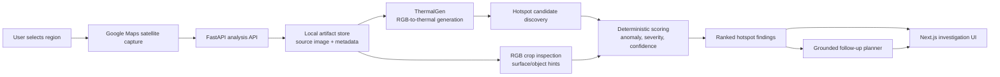

# UrbanLens Portfolio Architecture

UrbanLens is a hackathon-origin urban heat investigation system. The important engineering idea is not "an LLM looks at a map." It is a bounded pipeline where captured map imagery, generated thermal evidence, deterministic scoring, and LLM-assisted follow-up each have clear responsibilities.

## System Flow



## Deterministic vs AI-Assisted

| Layer | Deterministic? | Notes |
|---|---:|---|
| Capture metadata | Yes | Bounds, center, zoom, viewport, and image payload are structured inputs. |
| Artifact storage | Yes | Captures and generated outputs are stored under a region-specific local folder for replay/debugging. |
| ThermalGen inference | Model-based | Generates relative thermal evidence from RGB imagery. It is not a calibrated thermal measurement. |
| Hotspot proposal | Mostly deterministic | Candidate regions come from thermal evidence and image-space heuristics. |
| Surface/object hints | Mixed | Uses RGB heuristics and may use provider-backed classification when configured. |
| Scoring and ranking | Yes | Anomaly gate first; final rank score is `severity_score * confidence_score`. |
| Planner/follow-up | AI-assisted | Answers questions using stored analysis context and ranked findings. It should not invent evidence or override ranking. |

## Backend Boundaries

The backend is analysis-first, not chat-first.

- `POST /analysis/from-capture-upload` creates an analysis from map metadata and an image.
- `GET /analysis/{region_id}` returns the stable product state.
- `GET /analysis/{region_id}/debug` exposes scoring and trace details for inspection.
- `POST /analysis/{region_id}/questions` answers follow-up questions over an existing analysis.

This shape keeps the system understandable: user questions attach to a stored analysis artifact rather than becoming an unbounded chat session.

## Storage Tradeoff

For the hackathon and portfolio version, local file storage is intentional:

```text
backend/data/captures/{region_id}/
  metadata.json
  source.png
  aligned RGB / thermal preview outputs
```

This is easy to inspect, replay, and debug. A production version would move these artifacts to object storage with retention rules, access control, and background processing.

## LLM Boundary

UrbanLens uses provider-neutral LLM adapters for explanation and planning. The LLM can help summarize evidence, classify ambiguous crops when configured, and answer follow-up questions. It should not own:

- anomaly gating
- severity/confidence math
- final ranking order
- artifact persistence
- claims about calibrated physical temperature

## Why This Matters

The system demonstrates applied-AI engineering judgment: custom model integration, typed backend contracts, deterministic ranking, bounded LLM behavior, local reproducibility, and a frontend that makes the investigation legible.
