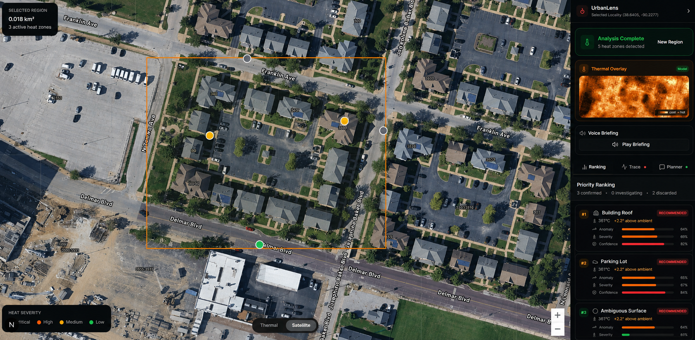
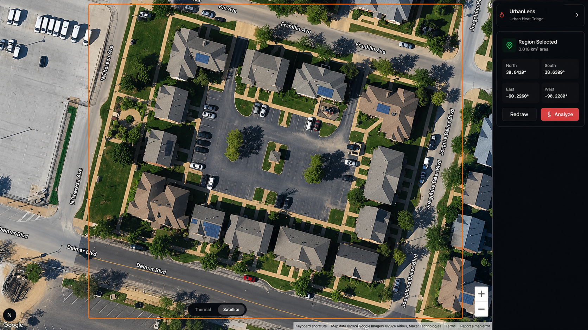
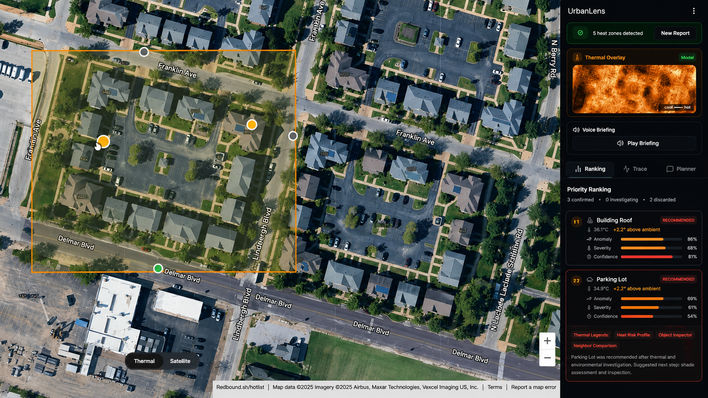
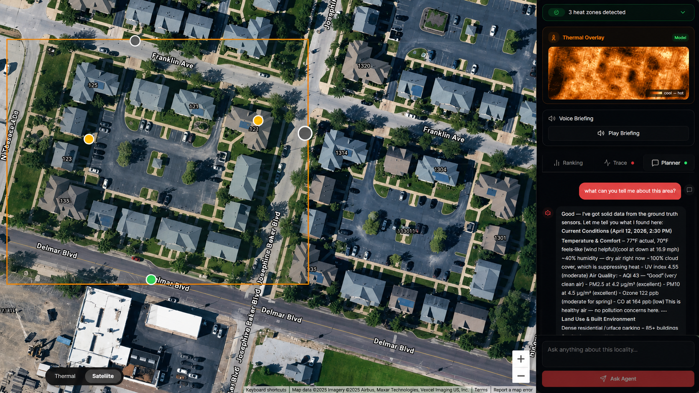

# UrbanLens

UrbanLens is a hackathon-origin urban heat investigation system built at the WashU Google Build with AI hackathon.

It lets a user select a region from Google Maps satellite imagery, captures that region, runs RGB-to-thermal generation through ThermalGen, proposes hotspot candidates, classifies visible surface types from RGB crops, ranks findings with deterministic scoring, and supports grounded follow-up questions over the stored analysis artifacts.

This repository is kept honest as a hackathon project: it is not production environmental measurement software, and ThermalGen outputs should be interpreted as relative thermal evidence rather than calibrated physical temperatures. The portfolio value is in the orchestration, typed contracts, artifact flow, scoring boundaries, and applied-AI system design.

- Demo video: [YouTube](https://www.youtube.com/watch?v=78SCFwdAIuk)
- Hackathon submission: [Devpost](https://devpost.com/software/urbanlens-uxwd48)




## What It Does

UrbanLens turns a selected satellite region into an investigation pipeline:

```text
Select map region
  -> capture satellite image and map metadata
  -> generate relative thermal evidence with ThermalGen
  -> propose candidate heat hotspots
  -> classify visible surface types from RGB crops
  -> compute anomaly, severity, confidence, and rank scores
  -> return prioritized findings and grounded follow-up answers
```

The system is designed around a clear boundary:

- Deterministic: capture handling, artifact storage, hotspot proposal, scoring, ranking, and API response contracts.
- AI-assisted: surface explanation, optional crop classification, investigation trace wording, and follow-up planning over stored results.
- Bounded: the LLM does not own ranking math or replace the analysis pipeline.

## Workflow

| Select locality | Rank heat findings | Ask grounded follow-up |
|---|---|---|
|  |  |  |

## System Components

### Frontend

- Next.js, React, TypeScript, Tailwind, and Google Maps.
- Region selection over satellite imagery.
- Static map capture sent to the backend with bounds, center, zoom, viewport, and image metadata.
- Thermal overlay, hotspot markers, ranking panel, recommendation details, trace timeline, and follow-up UI.

### Backend

- FastAPI service with Pydantic schemas.
- Analysis-first API resources rather than a chat-first shape.
- Capture ingestion and local artifact storage under `backend/data/captures/{region_id}/`.
- ThermalGen inference wrapper exposed as a callable backend tool.
- Hotspot proposal, perception helpers, deterministic scoring, ranking, debug views, and follow-up endpoints.

### ThermalGen

- PyTorch RGB-to-thermal model adapted for urban imagery.
- Produces relative thermal predictions from satellite captures.
- Supports hotspot discovery and overlay generation.
- Uses local checkpoints, which are intentionally treated as large external artifacts.

### Agent / Planner Layer

- Provider-neutral LLM layer with mock, Anthropic, Gemini, and Featherless paths.
- Uses stored analysis results as context for follow-up answers.
- Intended role: explain, plan, and summarize from existing evidence.
- Non-goal: invent new measurements or override deterministic ranking.

## API Shape

Canonical analysis flow:

```http
POST /analysis/from-capture-upload
GET  /analysis/{region_id}
GET  /analysis/{region_id}/events
GET  /analysis/{region_id}/debug
POST /analysis/{region_id}/questions
```

The main output converges to a stable `AnalysisResponse` containing:

- selected region metadata
- source and thermal artifact URLs
- hotspot candidates
- trace steps
- anomaly, severity, confidence, and final rank scores
- discarded and finalized candidates
- ranked top hotspots

Ranking is intentionally inspectable:

```text
if anomaly_score < anomaly_threshold:
    discard

final_rank_score = severity_score * confidence_score
```

See [backend/API_EXAMPLES.md](./backend/API_EXAMPLES.md) and [docs/contracts.md](./docs/contracts.md) for request and response examples.

For a no-key deterministic backend fixture, see [docs/demo_walkthrough.md](./docs/demo_walkthrough.md).

Quick backend checks:

```powershell
cd backend
python -m unittest discover tests
python scripts\demo_analysis.py
```

## Local Setup

Fast Windows setup:

```powershell
copy .env.example .env
notepad .env
.\scripts\dev.ps1
```

For the full local workflow and troubleshooting, see [docs/local-dev-setup.md](./docs/local-dev-setup.md).

The dev script reads the root `.env`, syncs service env files, then launches both servers. Use `LLM_PROVIDER=mock` for a local demo without external LLM keys.

Thermal inference still requires local model checkpoints under:

```text
backend/models/hybrid_thermal/checkpoints/
```

See [docs/local_setup.md](./docs/local_setup.md) for checkpoint and artifact details.

Manual fallback:

```powershell
.\scripts\sync-env.ps1

# Terminal 1
cd backend
python -m uvicorn app.main:app --reload

# Terminal 2
cd frontend
corepack pnpm dev
```

## Environment Variables

Edit the root `.env`. The service `.env` files are generated by `scripts/sync-env.ps1`.

Frontend:

```text
NEXT_PUBLIC_API_URL=http://localhost:8000
NEXT_PUBLIC_GOOGLE_MAPS_API_KEY=replace_with_google_maps_browser_key
```

Backend:

```text
LLM_PROVIDER=mock
ANTHROPIC_API_KEY=
ANTHROPIC_MODEL=
ANTHROPIC_VISION_MODEL=
GEMINI_API_KEY=
GEMINI_MODEL=
FEATHERLESS_API_KEY=
FEATHERLESS_MODEL=
FEATHERLESS_HTTP_REFERER=
FEATHERLESS_X_TITLE=
ELEVENLABS_API_KEY=
ELEVENLABS_VOICE_ID=
ELEVENLABS_MODEL_ID=
```

## Team

UrbanLens was built by a four-person team for the WashU Google Build with AI hackathon.

- [@postigodev](https://github.com/postigodev): Built the backend analysis backbone connecting capture ingestion, ThermalGen result handling, hotspot scoring, ranked intervention outputs, and stored analysis artifacts. Defined deterministic API and scoring boundaries so results stayed consistent, inspectable, and usable by the follow-up reasoning layer.

- [@tioluwani-enoch](https://github.com/tioluwani-enoch): Designed the frontend web app, UI/UX flow, map interaction model, and analysis presentation layer. Proposed using live Google Maps satellite imagery as the primary input, replacing the need for bulky static image datasets and making locality selection faster and more accessible.

- [@shuja-waraich-03](https://github.com/shuja-waraich-03): Built the agent investigation loop that turns user questions into multi-step tool-using analysis. The loop selects tools, executes them, feeds results back into the model, and continues until enough grounded evidence is available to answer.

- [@GALGALLOR](https://github.com/GALGALLOR): Adapted the ThermalGen model for urban heat analysis and built the preprocessing path for RGB-to-thermal inputs. Exposed model inference methods to the backend so ThermalGen could operate as a callable analysis tool inside the broader investigation pipeline.

## Hackathon Tradeoffs

- Local file storage is used for captures and generated artifacts. A production version would use object storage, retention policies, and access control.
- ThermalGen predictions are relative thermal evidence, not calibrated thermal camera measurements.
- Some model assets are large and are expected to be restored locally instead of committed directly.
- The analysis pipeline prioritizes a small, understandable tool set over broad autonomous agent behavior.
- The LLM layer is bounded to explanation and planning over stored evidence; ranking and discard decisions are deterministic.

## Production Improvements

Given more time, the next improvements would be:

- deterministic sample/demo mode with a small fixture and expected output
- tests for scoring, capture ingestion, and API response contracts
- durable persistence for analyses and artifacts
- stricter auth and API key management
- calibrated thermal validation against measured thermal imagery
- larger-region batching and queue-backed inference
- clearer surface classification evaluation metrics

## Repository Map

```text
backend/
  app/
    routes.py              FastAPI analysis endpoints
    schemas.py             Pydantic API contracts
    store.py               in-memory analysis store and artifact wiring
    capture_pipeline.py    capture storage and ThermalGen bridge
    thermal/               RGB-to-thermal inference integration
    scoring/               deterministic anomaly/severity/confidence/ranking logic
    perception/            surface and candidate helpers
    agent/                 tool/planner paths for follow-up reasoning

frontend/
  app/                     Next.js app shell
  components/              map, sidebar, ranking, recommendation, trace UI
  lib/api.ts               typed frontend API client
  lib/thermal-context.tsx  frontend analysis/session state

docs/
  architecture.md
  contracts.md
  demo.md
  local_setup.md
  archive/hackathon-planning/  historical hackathon planning notes
```

## License

UrbanLens is available under the [MIT License](./LICENSE).

## Scope and Limitations

UrbanLens should be read as a systems and applied-AI prototype: a working demo that shows how satellite capture, custom thermal generation, deterministic ranking, and grounded AI follow-up can fit together. It should not be used as a substitute for calibrated thermal surveys, safety inspections, or environmental engineering analysis.
